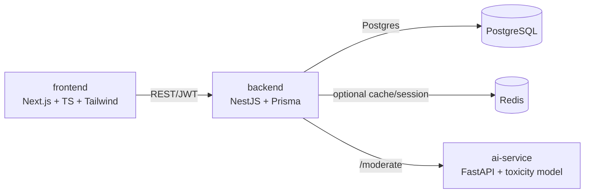
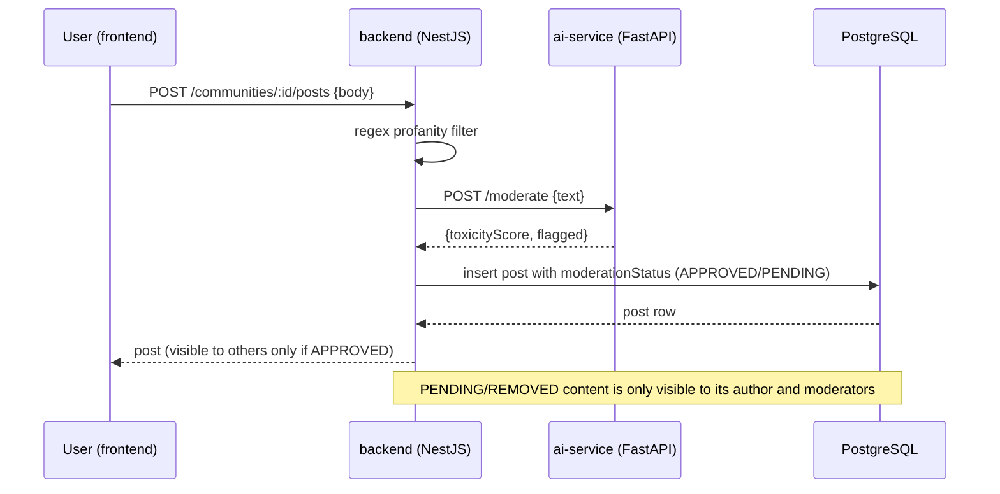

# SafeSpace

[](https://github.com/ayushagnihotrii/orbit/actions/workflows/ci.yml)

A safety-first social platform prototype for students aged 13+.

> **⚠️ PROTOTYPE — NOT FOR REAL MINORS.** This is a portfolio/proof-of-concept
> project. All users, posts, and accounts are test/synthetic data created by
> the developer for demonstration purposes. No real minors are onboarded to
> this system at any point.

## Why this exists

Most student social apps treat safety as a moderation afterthought bolted on
after growth. SafeSpace inverts that: every architectural decision —
what data is collected, how users can contact each other, what moderators
can see — is made safety-first. The goal is to demonstrate **safety-by-design**
and **AI-assisted moderation** as core engineering competencies, not just
CRUD features.

## Safety-by-design principles

These rules constrain every feature built in this repo:

1. **Data minimization.** We collect only: email, username, a hashed
   password, and a self-declared age (13+ gate). No real names, phone
   numbers, precise location, or behavioral tracking.
2. **No open stranger DMs.** Messaging only happens in visible, moderated
   group spaces, or between mutually-approved connections. There is no
   private 1-on-1 channel between users who haven't both opted in.
3. **Separated roles.** STUDENT and MODERATOR/ADMIN are distinct roles with
   no shared private channel between an unapproved adult-role account and a
   student account.
4. **Default-private profiles.** New profiles default to the most
   protective privacy setting available.
5. **Security hygiene.** Passwords hashed with argon2/bcrypt, parameterized
   queries only (Prisma), no sensitive data in logs, HTTPS-ready
   configuration, input validation/sanitization on every endpoint.

## Architecture



**Request flow for a new post or message:**



- **frontend/** — Next.js (App Router), TypeScript, Tailwind CSS. All pages
  are client components talking to the backend over a typed `fetch` wrapper
  with auto-refresh on expired JWTs.
- **backend/** — NestJS, TypeScript, Prisma ORM, JWT auth + RBAC
  (`@Roles`/`RolesGuard`), class-validator DTOs on every endpoint.
- **ai-service/** — Python FastAPI microservice exposing `/moderate`, used by
  the backend to score posts/messages/DMs for toxicity before they're shown
  to anyone but the author. Wraps a HuggingFace DistilBERT toxicity classifier
  with a heuristic keyword fallback if the model fails to load.
- **PostgreSQL** — primary datastore, accessed only through Prisma's
  parameterized query layer.
- **Redis** — provisioned via docker-compose for future session/cache use;
  not yet read from or written to by the backend.

This repo is a pnpm workspace containing `frontend` and `backend` as
workspace packages; `ai-service` is a standalone Python app managed with its
own virtualenv.

## Defense-in-depth moderation

Every post, chat message, and DM passes through two independent checks
before it's visible to anyone besides its author:

1. **Regex profanity filter** — fast, deterministic, catches explicit slurs
   and self-harm phrases the model sometimes misses.
2. **AI toxicity model** (`ai-service`) — catches hostile or threatening
   phrasing that doesn't use explicit profanity (the regex filter's blind
   spot).

If *either* layer flags content, it's held as `PENDING`: stored, but only
visible to its author until a moderator reviews it from `/moderation`. Every
report and every moderator action (approve/remove/warn/suspend) is recorded
in an append-only audit log. This two-layer design is intentional — small
toxicity classifiers reliably miss compound, non-profane hostile sentences
("you are such a worthless idiot, I hope you die" scored 99.5% *non-toxic*
in testing), so the regex layer and the human-review queue are load-bearing,
not redundant.

## Project status — v1 complete

Built incrementally, phase by phase:

- [x] Phase 1 — Project scaffold & architecture
- [x] Phase 2 — Auth & data-minimal user model
- [x] Phase 3 — Core social features (moderated by design)
- [x] Phase 4 — Safety & moderation system
- [x] Phase 5 — Polish: full frontend, seed data, this README

## Prerequisites

- Node.js 20+
- pnpm (`brew install pnpm` or `corepack enable pnpm`)
- Python 3.12 (3.13+ may lack prebuilt wheels for some ML deps used later)
- Docker Desktop (for local Postgres/Redis via `docker-compose.yml`) —
  alternatively, run Postgres natively (e.g. `brew install postgresql@16`)
  and point `DATABASE_URL` at it.

## Setup

```bash
# 1. Install JS dependencies (frontend + backend)
pnpm install

# 2. Copy env files and fill in any secrets
cp backend/.env.example backend/.env
cp frontend/.env.example frontend/.env
cp ai-service/.env.example ai-service/.env

# 3. Start local Postgres + Redis
pnpm db:up

# 4. Run Prisma migrations
cd backend && npx prisma migrate dev

# 5. Seed the database with synthetic test users, communities, posts,
#    and a few toxic samples so the moderation queue isn't empty on first run
pnpm run seed

# 6. Set up the AI service (separate Python environment — use 3.12,
#    not 3.13+, since the ML deps don't have prebuilt wheels for it yet)
cd ../ai-service
python3.12 -m venv .venv
source .venv/bin/activate
pip install -r requirements.txt
```

## Running in development

```bash
# Terminal 1 — backend (NestJS, http://localhost:3001)
pnpm dev:backend

# Terminal 2 — frontend (Next.js, http://localhost:3000)
pnpm dev:frontend

# Terminal 3 — AI moderation service (FastAPI, http://localhost:8001)
pnpm dev:ai
```

## Deploying

See [DEPLOYMENT.md](DEPLOYMENT.md) for the full Render (backend + ai-service
+ Postgres) + Vercel (frontend) deployment guide, including a
`render.yaml` Blueprint that provisions everything in one step.

## Try it out

After seeding, every account below uses the password `Password123!`:

| Username     | Role       | Notable seed data |
|--------------|------------|--------------------|
| `admin`      | ADMIN      | full access |
| `mod_taylor` | MODERATOR  | log in and visit `/moderation` — the queue has a flagged post and chat message waiting for review |
| `alice`      | STUDENT    | member of Robotics Club + Book Lovers, has an accepted connection (and DM history) with `dana` |
| `bob`        | STUDENT    | authored the one clean, already-approved post in Robotics Club |
| `charlie`    | STUDENT    | authored the toxic post/message sitting in the moderation queue, plus the one already removed (see `mod_taylor`'s audit log) |
| `dana`       | STUDENT    | created Book Lovers, accepted `alice`'s connection request |
| `erin`       | STUDENT    | has a pending (unaccepted) connection request to `bob` |

A representative walkthrough: log in as `alice`, open **Robotics Club**,
upvote bob's post, open `# general` chat and send a message, then log out
and back in as `mod_taylor` to see the queue and act on the flagged content.

## Tests

```bash
cd backend && pnpm test   # auth, moderation (defense-in-depth), connections/DM gating
```

## Repo layout

```
Orbit/
├── frontend/            Next.js app (auth, communities, chat, connections/DMs, moderation dashboard)
├── backend/             NestJS app + Prisma schema + seed script
├── ai-service/          FastAPI toxicity-scoring microservice
├── docker-compose.yml   Local Postgres + Redis
└── README.md            (this file)
```

## What's deliberately out of scope

This is a portfolio prototype, not a production service:

- No websockets — chat and DMs poll every 4 seconds instead.
- No JWT revocation list — access tokens are short-lived (15 min) and
  suspension is enforced by re-checking the user's `isSuspended` flag on
  every request, not by revoking the token itself.
- No file uploads — image posts take a URL string, not a binary upload.
- Redis is provisioned but unused — reserved for session/cache work that
  didn't make the cut for v1.
