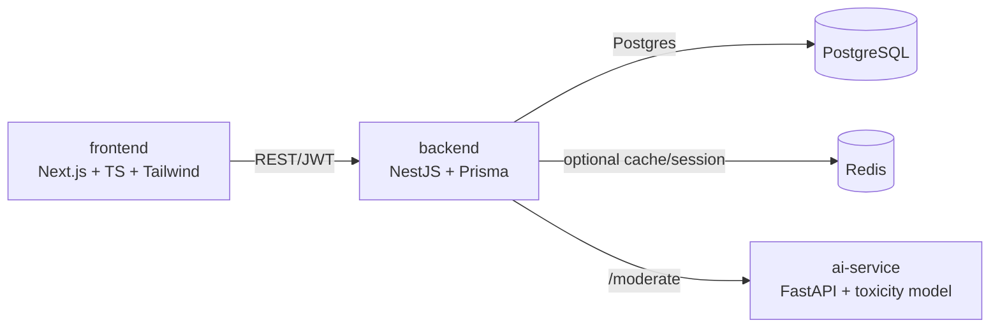

# SafeSpace

A safety-first social platform prototype for students aged 13+.

> **⚠️ PROTOTYPE — NOT FOR REAL MINORS.** This is a portfolio/proof-of-concept
> project. All users, posts, and accounts are test/synthetic data created by
> the developer for demonstration purposes. No real minors are onboarded to
> this system at any point.

## Why this exists

Most student social apps treat safety as a moderation afterthought bolted on
after growth. SafeSpace inverts that: every architectural decision —
what data is collected, how users can contact each other, what moderators
can see — is made safety-first. The goal is to demonstrate **safety-by-design**
and **AI-assisted moderation** as core engineering competencies, not just
CRUD features.

## Safety-by-design principles

These rules constrain every feature built in this repo:

1. **Data minimization.** We collect only: email, username, a hashed
   password, and a self-declared age (13+ gate). No real names, phone
   numbers, precise location, or behavioral tracking.
2. **No open stranger DMs.** Messaging only happens in visible, moderated
   group spaces, or between mutually-approved connections. There is no
   private 1-on-1 channel between users who haven't both opted in.
3. **Separated roles.** STUDENT and MODERATOR/ADMIN are distinct roles with
   no shared private channel between an unapproved adult-role account and a
   student account.
4. **Default-private profiles.** New profiles default to the most
   protective privacy setting available.
5. **Security hygiene.** Passwords hashed with argon2/bcrypt, parameterized
   queries only (Prisma), no sensitive data in logs, HTTPS-ready
   configuration, input validation/sanitization on every endpoint.

## Architecture



- **frontend/** — Next.js (App Router), TypeScript, Tailwind CSS.
- **backend/** — NestJS, TypeScript, Prisma ORM, JWT auth + RBAC.
- **ai-service/** — Python FastAPI microservice exposing `/moderate`,
  used by the backend to score posts/messages for toxicity before they're
  published (wired up in Phase 4).
- **PostgreSQL** — primary datastore, accessed only through Prisma's
  parameterized query layer.
- **Redis** — optional cache/session store (stubbed for v1).

This repo is a pnpm workspace containing `frontend` and `backend` as
workspace packages; `ai-service` is a standalone Python app managed with its
own virtualenv.

## Project status

Built incrementally, phase by phase:

- [x] Phase 1 — Project scaffold & architecture
- [ ] Phase 2 — Auth & data-minimal user model
- [ ] Phase 3 — Core social features (moderated by design)
- [ ] Phase 4 — Safety & moderation system
- [ ] Phase 5 — Polish for portfolio

## Prerequisites

- Node.js 20+
- pnpm (`brew install pnpm` or `corepack enable pnpm`)
- Python 3.12 (3.13+ may lack prebuilt wheels for some ML deps used later)
- Docker Desktop (for local Postgres/Redis via `docker-compose.yml`) —
  alternatively, run Postgres natively (e.g. `brew install postgresql@16`)
  and point `DATABASE_URL` at it.

## Setup

```bash
# 1. Install JS dependencies (frontend + backend)
pnpm install

# 2. Copy env files and fill in any secrets
cp backend/.env.example backend/.env
cp frontend/.env.example frontend/.env
cp ai-service/.env.example ai-service/.env

# 3. Start local Postgres + Redis
pnpm db:up

# 4. Run Prisma migrations (once models exist, from Phase 2 onward)
cd backend && npx prisma migrate dev

# 5. Set up the AI service (separate Python environment)
cd ai-service
python3 -m venv .venv
source .venv/bin/activate
pip install -r requirements.txt
```

## Running in development

```bash
# Terminal 1 — backend (NestJS, http://localhost:3001)
pnpm dev:backend

# Terminal 2 — frontend (Next.js, http://localhost:3000)
pnpm dev:frontend

# Terminal 3 — AI moderation service (FastAPI, http://localhost:8001)
pnpm dev:ai
```

## Repo layout

```
Orbit/
├── frontend/        Next.js app
├── backend/          NestJS app + Prisma schema
├── ai-service/       FastAPI toxicity-scoring microservice
├── docker-compose.yml  Local Postgres + Redis
└── README.md         (this file)
```
